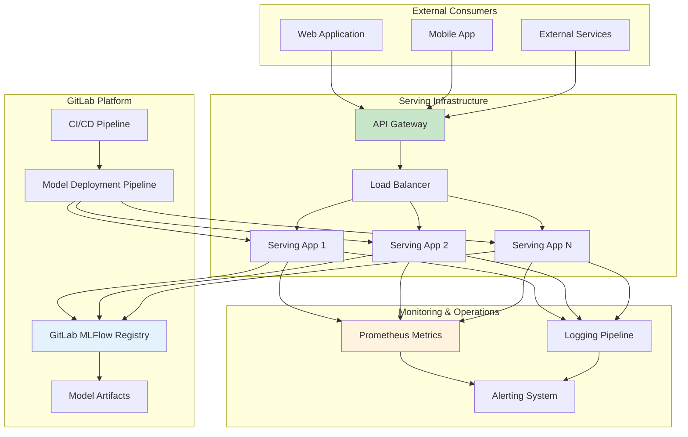

# Serving de Modelos no GitLab: API Externa vs Integrada

## 1. Necessidade de API Externa: Sim, Quase Sempre

### 1.1. Por que API Externa é Necessária

**GitLab como Plataforma de Desenvolvimento vs. Produção:**

O GitLab é excelente para desenvolvimento, CI/CD e gestão de modelos, mas **não é uma plataforma de serving de produção**. O GitLab MLFlow serve principalmente como:
- **Repositório** de modelos versionados
- **Tracking** de experimentos
- **Registry** para gestão de lifecycle dos modelos
- **CI/CD** para automação de pipelines

**Limitações do GitLab para Serving Direto:**
- **Performance**: GitLab não é otimizado para serving de alta performance
- **Escalabilidade**: Não tem capacidades de auto-scaling para inferência
- **Disponibilidade**: GitLab pode ter maintenance windows que afetariam serving
- **Latência**: Não oferece otimizações específicas para baixa latência de inferência
- **Load Balancing**: Não tem load balancing otimizado para ML workloads

### 1.2. Arquitetura Padrão Recomendada



## 2. Fluxo Padrão Após Seleção do Melhor Modelo

### 2.1. Fase 1: Registro e Promoção do Modelo

**Processo Automático no Pipeline:**

Quando o pipeline de retreinamento identifica um modelo melhor que o atual:

1. **Registro no MLFlow Registry:**
   - Modelo é registrado como nova versão
   - Métricas de performance são anexadas
   - Artifacts necessários são armazenados

2. **Promoção Gradual:**
   - Modelo recebe alias `staging` automaticamente
   - Testes automatizados são executados
   - Se aprovado, recebe alias `candidate`

3. **Validação de Qualidade:**
   - Testes de performance
   - Validação de fairness
   - Testes de robustez
   - Verificação de drift reverso

```yaml
# Exemplo de pipeline GitLab
register-best-model:
  stage: register
  script:
    - python scripts/evaluate_models.py
    - python scripts/register_champion.py
  artifacts:
    reports:
      dotenv: model_info.env  # MODEL_VERSION=1.2.3
```

### 2.2. Fase 2: Build da Aplicação de Serving

**Containerização Automática:**

O GitLab CI/CD automaticamente builda uma aplicação containerizada que serve o novo modelo:

```yaml
build-serving-app:
  stage: build
  dependencies:
    - register-best-model
  script:
    - echo "Building serving app with model version $MODEL_VERSION"
    - docker build 
        --build-arg MODEL_NAME=$MODEL_NAME
        --build-arg MODEL_VERSION=$MODEL_VERSION
        --build-arg MLFLOW_URI=$MLFLOW_TRACKING_URI
        -t $CI_REGISTRY_IMAGE/serving:$CI_COMMIT_SHA .
    - docker push $CI_REGISTRY_IMAGE/serving:$CI_COMMIT_SHA
```

**Dockerfile da Aplicação de Serving:**

```dockerfile
FROM python:3.9-slim

ARG MODEL_NAME
ARG MODEL_VERSION
ARG MLFLOW_URI

# Install dependencies
COPY requirements.txt .
RUN pip install -r requirements.txt

# Copy application code
COPY app/ /app/
WORKDIR /app

# Configure environment
ENV MODEL_NAME=$MODEL_NAME
ENV MODEL_VERSION=$MODEL_VERSION
ENV MLFLOW_TRACKING_URI=$MLFLOW_URI

# Health check
HEALTHCHECK --interval=30s --timeout=10s --retries=3 \
  CMD curl -f http://localhost:8000/health || exit 1

# Run application
EXPOSE 8000
CMD ["uvicorn", "main:app", "--host", "0.0.0.0", "--port", "8000"]
```

### 2.3. Fase 3: Deploy em Staging

**Ambiente de Staging Automático:**

```yaml
deploy-staging:
  stage: deploy-staging
  script:
    - helm upgrade --install ml-serving-staging ./helm-chart/
        --set image.tag=$CI_COMMIT_SHA
        --set model.name=$MODEL_NAME
        --set model.version=staging
        --set environment=staging
        --namespace=ml-staging
  environment:
    name: staging
    url: https://ml-api-staging.exemplo.com
```

**Testes Automatizados em Staging:**

```yaml
test-staging:
  stage: test
  dependencies:
    - deploy-staging
  script:
    - python tests/integration_tests.py --environment=staging
    - python tests/performance_tests.py --environment=staging
    - python tests/load_tests.py --environment=staging
  artifacts:
    reports:
      junit: test-results.xml
```

### 2.4. Fase 4: Validação e Aprovação

**Gates de Qualidade Automáticos:**

O sistema automaticamente valida:
- **Response Time**: P95 < 100ms
- **Accuracy**: Mantém ou melhora accuracy atual
- **Throughput**: Suporta carga esperada
- **Error Rate**: < 0.1%
- **Resource Usage**: Dentro dos limites definidos

**Aprovação Manual para Produção:**

```yaml
deploy-production:
  stage: deploy-production
  script:
    - python scripts/promote_to_production.py
    - helm upgrade --install ml-serving-prod ./helm-chart/
        --set image.tag=$CI_COMMIT_SHA
        --set model.version=champion
        --set environment=production
  when: manual
  only:
    - main
  environment:
    name: production
    url: https://ml-api.exemplo.com
```

### 2.5. Fase 5: Deploy Produção com Blue-Green

**Estratégia Blue-Green Automática:**

```yaml
deploy-blue-green:
  stage: deploy
  script:
    # Deploy para ambiente "green" (inativo)
    - kubectl apply -f k8s/green-deployment.yaml
    
    # Aguardar deployment e health checks
    - kubectl rollout status deployment/ml-serving-green
    
    # Executar smoke tests no green
    - python tests/smoke_tests.py --target=green
    
    # Switch traffic gradualmente
    - python scripts/traffic_switch.py --from=blue --to=green --percentage=10
    - sleep 300  # 5 minutos de observação
    - python scripts/traffic_switch.py --from=blue --to=green --percentage=50
    - sleep 300
    - python scripts/traffic_switch.py --from=blue --to=green --percentage=100
    
    # Cleanup do ambiente blue antigo
    - kubectl delete deployment/ml-serving-blue
```

## 3. Arquitetura da API de Serving

### 3.1. Aplicação de Serving Típica

**Estrutura da Aplicação:**

```
serving-app/
├── app/
│   ├── main.py              # FastAPI application
│   ├── models/
│   │   ├── __init__.py
│   │   ├── loader.py        # Model loading logic
│   │   └── predictor.py     # Prediction logic
│   ├── api/
│   │   ├── __init__.py
│   │   ├── routes.py        # API endpoints
│   │   └── schemas.py       # Request/response schemas
│   ├── core/
│   │   ├── __init__.py
│   │   ├── config.py        # Configuration
│   │   └── logging.py       # Logging setup
│   └── utils/
│       ├── __init__.py
│       ├── monitoring.py    # Metrics and monitoring
│       └── health.py        # Health checks
├── tests/
├── requirements.txt
├── Dockerfile
└── helm-chart/
```

### 3.2. Endpoints Essenciais

**API Endpoints Padrão:**

1. **Health Check:**
   ```
   GET /health
   Response: {"status": "healthy", "model_version": "1.2.3"}
   ```

2. **Model Info:**
   ```
   GET /model/info
   Response: {
     "name": "sales-prediction",
     "version": "1.2.3",
     "created_at": "2024-01-15T10:30:00Z",
     "metrics": {"accuracy": 0.94, "f1": 0.91}
   }
   ```

3. **Single Prediction:**
   ```
   POST /predict
   Body: {"features": {"age": 25, "income": 50000}}
   Response: {"prediction": 0.85, "confidence": 0.92}
   ```

4. **Batch Prediction:**
   ```
   POST /predict/batch
   Body: {"samples": [{"age": 25}, {"age": 30}]}
   Response: {"predictions": [0.85, 0.78]}
   ```

### 3.3. Carregamento Dinâmico de Modelos

**Model Loader com Cache:**

```python
class ModelLoader:
    def __init__(self):
        self.cache = {}
        self.mlflow_client = MlflowClient()
        
    def load_model(self, model_name: str, alias: str = "champion"):
        cache_key = f"{model_name}@{alias}"
        
        if cache_key not in self.cache:
            # Load from GitLab MLFlow
            model_uri = f"models:/{model_name}@{alias}"
            model = mlflow.pyfunc.load_model(model_uri)
            self.cache[cache_key] = model
            
        return self.cache[cache_key]
```

**Hot Reloading de Modelos:**

```python
class ModelManager:
    def __init__(self):
        self.current_model = None
        self.model_version = None
        
    async def check_for_updates(self):
        """Verifica periodicamente se há nova versão do modelo"""
        latest_version = self.get_latest_production_version()
        
        if latest_version != self.model_version:
            logger.info(f"Nova versão detectada: {latest_version}")
            await self.reload_model(latest_version)
    
    async def reload_model(self, version: str):
        """Recarrega modelo sem downtime"""
        new_model = self.load_model(version)
        
        # Warm up do novo modelo
        await self.warm_up_model(new_model)
        
        # Atomic swap
        old_model = self.current_model
        self.current_model = new_model
        self.model_version = version
        
        # Cleanup
        del old_model
        gc.collect()
```

## 4. Integração GitLab ↔ API Externa

### 4.1. Configuração de Secrets e Variáveis

**GitLab CI/CD Variables:**

```yaml
variables:
  MLFLOW_TRACKING_URI: "https://gitlab.exemplo.com/api/v4/projects/123/ml/mlflow"
  MODEL_NAME: "sales-prediction"
  SERVING_APP_IMAGE: "$CI_REGISTRY_IMAGE/serving"
  
# Protected variables (apenas em branches protegidos)
# MLFLOW_TRACKING_TOKEN: "glpat-xxxxx"
# KUBE_CONFIG: "base64_encoded_kubeconfig"
```

### 4.2. Service Discovery e Configuration

**Configuração da Aplicação:**

```python
class Settings:
    # GitLab MLFlow connection
    mlflow_tracking_uri: str = os.getenv("MLFLOW_TRACKING_URI")
    mlflow_tracking_token: str = os.getenv("MLFLOW_TRACKING_TOKEN")
    
    # Model configuration
    model_name: str = os.getenv("MODEL_NAME", "default-model")
    model_alias: str = os.getenv("MODEL_ALIAS", "champion")
    
    # Performance settings
    max_batch_size: int = int(os.getenv("MAX_BATCH_SIZE", "100"))
    model_cache_ttl: int = int(os.getenv("MODEL_CACHE_TTL", "3600"))
    
    # Monitoring
    metrics_enabled: bool = os.getenv("METRICS_ENABLED", "true").lower() == "true"
    log_level: str = os.getenv("LOG_LEVEL", "INFO")
```

### 4.3. Monitoring e Observabilidade

**Métricas Personalizadas:**

```python
from prometheus_client import Counter, Histogram, Gauge

# Métricas de negócio
prediction_counter = Counter(
    'ml_predictions_total',
    'Total predictions made',
    ['model_name', 'model_version', 'status']
)

prediction_latency = Histogram(
    'ml_prediction_duration_seconds',
    'Time spent on predictions',
    ['model_name']
)

model_confidence = Histogram(
    'ml_prediction_confidence',
    'Distribution of prediction confidence scores',
    ['model_name']
)

active_model_info = Gauge(
    'ml_active_model_info',
    'Information about active model',
    ['model_name', 'version', 'created_at']
)
```

**Integration com GitLab Monitoring:**

```yaml
# .gitlab-ci.yml
monitor-production:
  stage: monitor
  script:
    - python scripts/collect_production_metrics.py
    - python scripts/update_gitlab_metrics.py
  artifacts:
    reports:
      metrics: metrics.txt
  rules:
    - if: $CI_PIPELINE_SOURCE == "schedule"
```

## 5. Padrões de Deploy Avançados

### 5.1. Canary Deployment com Feature Flags

**Implementação com Traffic Splitting:**

```python
class TrafficSplitter:
    def __init__(self):
        self.feature_flags = FeatureFlagClient()
        
    def route_request(self, user_id: str, request: dict):
        """Roteia request baseado em feature flags"""
        
        if self.feature_flags.is_enabled("new_model_canary", user_id):
            # Usar novo modelo para subset de usuários
            return self.predict_with_model("candidate")
        else:
            # Usar modelo estável para maioria
            return self.predict_with_model("champion")
```

### 5.2. A/B Testing Automático

**Framework de A/B Testing:**

```python
class ABTestManager:
    def __init__(self):
        self.experiments = ExperimentConfig()
        
    def assign_variant(self, user_id: str) -> str:
        """Assign user to A or B variant consistently"""
        hash_value = int(hashlib.md5(user_id.encode()).hexdigest(), 16)
        return "champion" if hash_value % 100 < 50 else "candidate"
        
    def log_experiment_result(self, user_id: str, variant: str, 
                            prediction: float, outcome: float = None):
        """Log experiment data for analysis"""
        self.experiment_tracker.log({
            "user_id": user_id,
            "variant": variant,
            "prediction": prediction,
            "outcome": outcome,
            "timestamp": datetime.now()
        })
```

### 5.3. Multi-Model Serving

**Serving Múltiplos Modelos:**

```python
class MultiModelServer:
    def __init__(self):
        self.models = {}
        self.load_all_production_models()
        
    def load_all_production_models(self):
        """Carrega todos os modelos em produção"""
        production_models = self.mlflow_client.search_registered_models()
        
        for model in production_models:
            try:
                champion_version = self.mlflow_client.get_model_version_by_alias(
                    model.name, "champion"
                )
                self.models[model.name] = self.load_model(
                    model.name, "champion"
                )
            except Exception as e:
                logger.warning(f"Failed to load {model.name}: {e}")
    
    async def predict(self, model_name: str, features: dict):
        """Fazer predição com modelo específico"""
        if model_name not in self.models:
            raise ValueError(f"Model {model_name} not available")
            
        return self.models[model_name].predict([features])[0]
```

## 6. Resumo: Fluxo Completo End-to-End

### 6.1. Fluxo Simplificado

```
1. GitLab Pipeline treina modelos → MLFlow Registry
2. Melhor modelo é selecionado → Promoted to "candidate"
3. GitLab CI/CD builda aplicação de serving → Container Registry
4. Deploy automático em staging → Testes automatizados
5. Aprovação manual → Deploy produção com Blue-Green
6. API externa serve predições → Carrega modelos do GitLab MLFlow
7. Monitoring contínuo → Feedback para próximo ciclo
```

### 6.2. Benefícios desta Arquitetura

- **Separação de Responsabilidades**: GitLab para development, API externa para serving
- **Escalabilidade**: API pode escalar independentemente do GitLab
- **Confiabilidade**: GitLab maintenance não afeta serving
- **Performance**: API otimizada especificamente para inferência
- **Flexibilidade**: Pode servir modelos de diferentes sources
- **Observabilidade**: Monitoring específico para ML workloads

**Conclusão**: API externa é definitivamente necessária e recomendada. O GitLab serve como o "brain" que gerencia o lifecycle dos modelos, enquanto a API externa serve como o "muscle" que executa inferências em produção de forma eficiente e escalável.