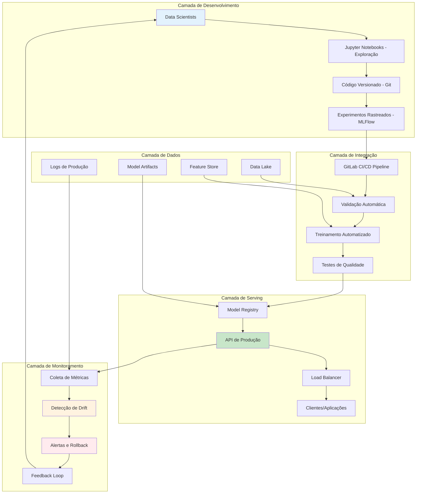
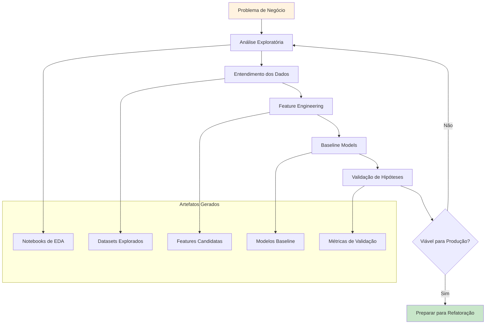
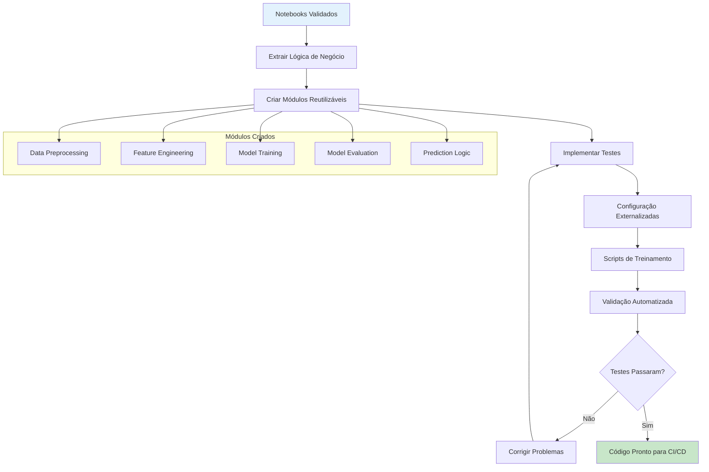
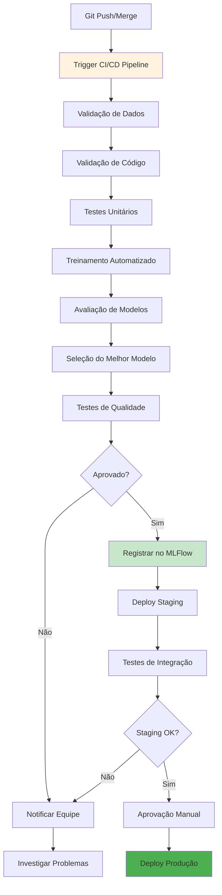
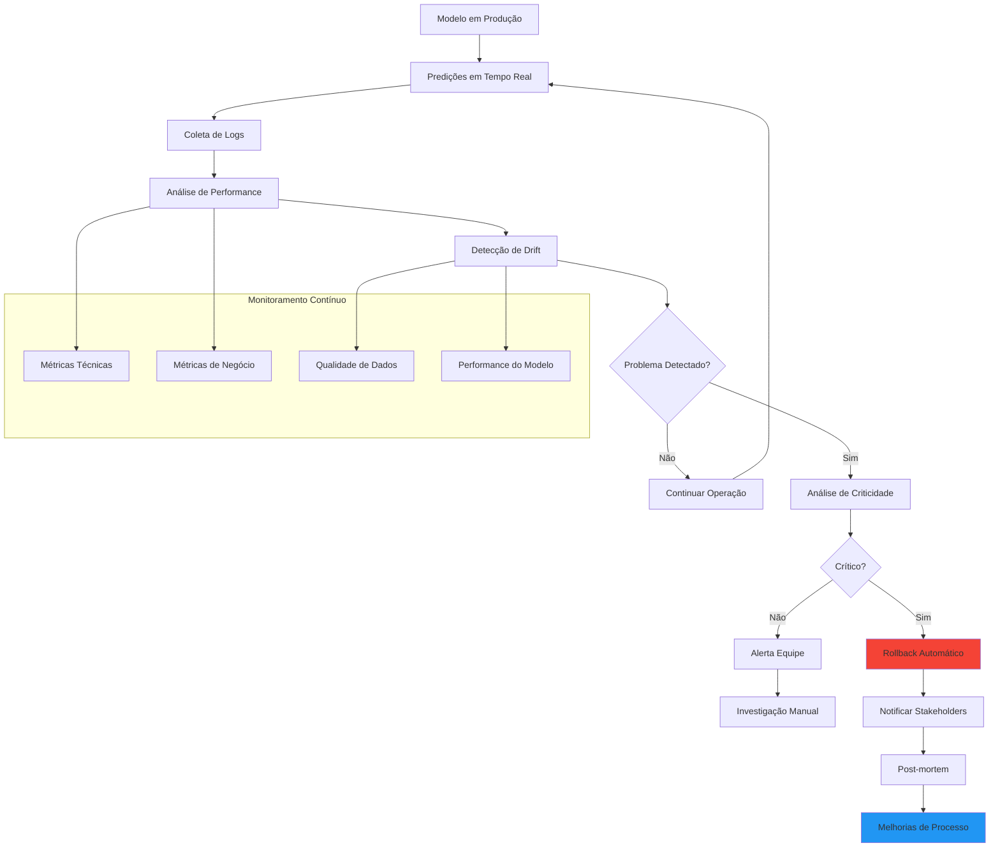

# MLOps: Transformação Completa do Desenvolvimento à Produção

## 1. A Realidade Atual: O Problema dos Notebooks

### 1.1. Como Data Scientists Trabalham Hoje

A maioria dos Data Scientists desenvolve modelos de Machine Learning em Jupyter Notebooks, seguindo um processo que parece natural mas esconde armadilhas perigosas. O workflow típico consiste em explorar dados em células interativas, experimentar diferentes algoritmos, ajustar hiperparâmetros manualmente e, quando satisfeitos com os resultados, salvar o modelo usando bibliotecas como pickle ou joblib.

Este processo funciona perfeitamente para prototipagem e experimentação, mas cria um abismo entre desenvolvimento e produção. O modelo que funciona no notebook do cientista de dados raramente funciona da mesma forma quando precisa ser integrado a um sistema real, atendendo milhares de usuários simultâneos.

### 1.2. Os Perigos Ocultos do Desenvolvimento em Notebooks

**Falta de Reprodutibilidade**: Notebooks são executados de forma não-linear. Células podem ser executadas fora de ordem, variáveis podem ser modificadas sem documentação, e o estado final do notebook pode não representar o que realmente aconteceu durante o desenvolvimento. Isto significa que outro cientista de dados (ou o mesmo cientista, semanas depois) pode não conseguir reproduzir exatamente os mesmos resultados.

**Dependências Não Documentadas**: Notebooks frequentemente dependem de versões específicas de bibliotecas, dados preprocessados externamente, ou até mesmo de variáveis de ambiente específicas da máquina do desenvolvedor. Estas dependências raramente são documentadas adequadamente.

**Código Não Testado**: Notebooks incentivam experimentação rápida, mas raramente incluem testes automatizados. Funções de preprocessamento, feature engineering e até mesmo a lógica de avaliação de modelos ficam sem validação sistemática.

**Deployment Manual e Propenso a Erros**: Quando chega a hora de colocar o modelo em produção, o processo geralmente envolve copiar código do notebook, adaptar para um script Python, configurar um servidor manualmente, e torcer para que tudo funcione. Este processo manual é lento, propenso a erros e não escalável.

### 1.3. O Custo Real Destes Problemas

Empresas relatam que apenas 10-20% dos modelos de ML desenvolvidos chegam efetivamente à produção. Dos que chegam, muitos falham silenciosamente ao longo do tempo devido à degradação de performance, mudanças nos dados, ou simplesmente bugs não detectados. O custo de manter modelos em produção pode ser 10x maior que o custo de desenvolvê-los inicialmente.

## 2. A Solução MLOps: Visão Geral da Transformação

### 2.1. O Que é MLOps e Por Que Importa

MLOps (Machine Learning Operations) é a aplicação de princípios DevOps ao ciclo de vida de Machine Learning. Assim como DevOps revolucionou o desenvolvimento de software ao automatizar builds, testes e deploys, MLOps automatiza o ciclo completo desde experimentação até produção e monitoramento de modelos de ML.

A diferença fundamental é que MLOps precisa lidar com desafios únicos do ML: dados que mudam constantemente, modelos que degradam com o tempo, necessidade de experimentação contínua, e a dificuldade de testar sistemas probabilísticos.

### 2.2. Os Pilares Fundamentais do MLOps

**Versionamento Inteligente**: Não apenas código, mas dados, modelos, experimentos e até mesmo a infraestrutura precisam ser versionados. Cada mudança deve ser rastreável e reversível.

**Automação Completa**: Desde a validação dos dados até o deployment em produção, cada etapa deve ser automatizada e testada. Intervenção manual deve ser a exceção, não a regra.

**Monitoramento Contínuo**: Modelos de ML não são software tradicional - eles podem degradar silenciosamente. É essencial monitorar não apenas performance técnica (latência, disponibilidade), mas também performance estatística (accuracy, drift de dados).

**Colaboração Eficiente**: Data Scientists, Engenheiros de ML, DevOps e equipes de negócio precisam trabalhar juntos de forma fluida. Ferramentas e processos devem facilitar esta colaboração, não criar silos.

### 2.3. A Jornada de Transformação

A transformação de notebooks para MLOps não acontece da noite para o dia. É uma jornada que tipicamente leva 2-6 meses, dependendo da maturidade da organização e complexidade dos modelos existentes. O processo envolve não apenas mudanças técnicas, mas também culturais e organizacionais.

## 3. Arquitetura Completa do Sistema MLOps

### 3.1. Visão de Alto Nível da Arquitetura

A arquitetura é organizada em cinco camadas principais, cada uma com responsabilidades específicas e bem definidas.

### 3.2. Camada de Desenvolvimento: Onde Tudo Começa

Esta camada mantém a familiaridade dos Data Scientists com notebooks, mas adiciona estrutura e governança. Os cientistas continuam explorando dados e experimentando algoritmos em Jupyter, mas agora seguem padrões estabelecidos para versionamento e documentação.

**Jupyter Notebooks para Exploração**: Notebooks continuam sendo usados para análise exploratória de dados (EDA), prototipagem rápida e validação de hipóteses. A diferença é que agora existe um template padrão e diretrizes claras sobre o que deve ficar no notebook versus o que deve ser refatorado para código de produção.

**Git para Versionamento**: Todo código, incluindo notebooks, é versionado no Git. Isso inclui não apenas o código final, mas também as versões intermediárias dos experimentos, permitindo rastrear a evolução do pensamento e das descobertas.

**MLFlow para Tracking**: Cada experimento, mesmo aqueles executados em notebooks, é automaticamente rastreado no MLFlow. Isso inclui parâmetros, métricas, artefatos e até mesmo o próprio notebook como artefato do experimento.

### 3.3. Camada de Integração: Automação Inteligente

Esta é onde a mágica acontece. Quando código é commitado no Git, uma série de processos automatizados são disparados para validar, treinar e testar modelos sem intervenção humana.

**Pipeline de Validação**: Antes mesmo de treinar modelos, o sistema valida a qualidade dos dados, verifica se o código segue padrões estabelecidos, executa testes unitários e garante que não há regressões.

**Treinamento Automatizado**: O sistema automaticamente treina múltiplos modelos com diferentes configurações, sempre registrando tudo no MLFlow. Isso permite comparação sistemática e seleção do melhor modelo baseada em critérios objetivos.

**Testes de Qualidade**: Modelos passam por uma bateria de testes automatizados: performance em dados de teste, fairness, robustez a adversários, e até mesmo testes de sanidade básicos como verificar se o modelo não está sempre predizendo a mesma classe.

### 3.4. Camada de Serving: Modelos Como Serviços

Esta camada transforma modelos em serviços robustos, escaláveis e monitorizáveis que podem ser consumidos por aplicações reais.

**Model Registry**: Um repositório centralizado onde todos os modelos validados são armazenados com versionamento semântico, metadados ricos e políticas de acesso. Modelos têm estágios claramente definidos: desenvolvimento, staging, produção.

**API de Produção**: Uma API RESTful robusta que serve predições com baixa latência, alta disponibilidade e capacidade de lidar com picos de tráfego. Inclui funcionalidades como batch prediction, A/B testing automático e circuit breakers.

**Infraestrutura Escalável**: Load balancers, auto-scaling, health checks e todas as funcionalidades necessárias para servir modelos em escala enterprise.

### 3.5. Camada de Monitoramento: Vigilância Constante

Modelos de ML são únicos porque podem degradar silenciosamente ao longo do tempo. Esta camada monitora não apenas aspectos técnicos, mas também a qualidade estatística das predições.

**Monitoramento de Performance**: Latência, throughput, disponibilidade e outros KPIs técnicos são monitorados em tempo real com alertas automáticos para anomalias.

**Detecção de Drift**: Algoritmos estatísticos automaticamente detectam quando os dados de entrada estão mudando de forma significativa comparado aos dados de treinamento. Isso pode indicar que o modelo precisa ser retreinado.

**Feedback e Rollback**: Quando problemas são detectados, o sistema pode automaticamente fazer rollback para uma versão anterior estável, minimizando o impacto nos usuários finais.

## 4. Fluxo Detalhado: Do Notebook à Produção

### 4.1. Fase 1: Exploração e Prototipagem

Esta fase mantém a familiaridade e agilidade dos notebooks, mas com estrutura adicional. Data Scientists começam com um problema de negócio claramente definido e exploram os dados disponíveis para entender padrões, identificar problemas de qualidade e formular hipóteses.

**Análise Exploratória Estruturada**: Ao invés de exploração ad-hoc, cientistas seguem um template que garante que aspectos importantes sejam sempre considerados: distribuições de features, correlações, missing values, outliers, e vieses potenciais.

**Feature Engineering Documentada**: Cada transformação aplicada aos dados é documentada com o raciocínio por trás dela. Isso facilita a posterior refatoração para código de produção e ajuda outros membros da equipe a entender as decisões tomadas.

**Modelos Baseline**: Antes de partir para algoritmos complexos, sempre estabelecer baselines simples. Isso ajuda a entender se a complexidade adicional realmente vale a pena e fornece um ponto de comparação objetivo.

### 4.2. Fase 2: Refatoração e Modularização

Esta é talvez a fase mais crítica da transformação. O código exploratório dos notebooks precisa ser refatorado em módulos robustos, testáveis e reutilizáveis, sem perder a lógica de negócio desenvolvida durante a exploração.

**Extração de Lógica**: Identificar qual código dos notebooks representa lógica de negócio real versus código exploratório. A lógica real é extraída e organizada em funções e classes bem definidas.

**Modularização**: O código é organizado em módulos com responsabilidades claras: um módulo para preprocessing, outro para feature engineering, outro para treinamento, etc. Cada módulo tem uma interface bem definida e pode ser testado independentemente.

**Externalização de Configurações**: Parâmetros que eram hardcoded nos notebooks são movidos para arquivos de configuração externos (YAML, JSON). Isso permite experimentar com diferentes configurações sem modificar código.

**Testes Abrangentes**: Cada função crítica recebe testes automatizados. Isso inclui testes unitários para funções individuais, testes de integração para módulos completos, e testes de regressão para garantir que mudanças não quebram funcionalidades existentes.

### 4.3. Fase 3: Automação de Pipeline

Aqui é onde a automação realmente mostra seu valor. Um simples commit no Git dispara uma cascata de processos automatizados que validam, treinam e testam modelos sem intervenção humana.

**Validação Automática**: Antes mesmo de treinar modelos, o sistema valida que os dados estão no formato esperado, que não há missing values inesperados, que distribuições não mudaram drasticamente, e que o código segue padrões de qualidade.

**Treinamento Orquestrado**: O sistema automaticamente treina múltiplos modelos com diferentes hiperparâmetros, sempre registrando todos os experimentos no MLFlow. Isso permite comparação sistemática e seleção baseada em critérios objetivos.

**Gates de Qualidade**: Modelos só passam para a próxima fase se atenderem critérios mínimos de qualidade. Isso inclui performance em datasets de teste, mas também critérios como fairness, robustez e interpretabilidade.

**Deploy Progressivo**: Modelos primeiro vão para staging onde passam por testes mais rigorosos em um ambiente que simula produção. Só depois de aprovados manualmente podem ir para produção.

### 4.4. Fase 4: Serving e Monitoramento

Esta fase é sobre operação contínua e melhoria contínua. Modelos em produção são constantemente monitorados e o sistema reage automaticamente a problemas.

**Serving Robusto**: A API de produção é projetada para alta disponibilidade com load balancing, auto-scaling, circuit breakers e graceful degradation. Pode lidar com picos de tráfego e falhas de componentes individuais.

**Monitoramento Multinível**: O sistema monitora não apenas métricas técnicas (latência, throughput), mas também métricas específicas de ML (drift de dados, degradação de performance) e métricas de negócio (conversão, satisfação do usuário).

**Resposta Automática**: Quando problemas são detectados, o sistema pode automaticamente escalar recursos, fazer rollback para versões anteriores, ou até mesmo desabilitar temporariamente certas funcionalidades para proteger a experiência do usuário.

## 5. Componentes Críticos do Sistema

### 5.1. MLFlow: O Coração do Tracking

MLFlow serve como o sistema nervoso central do pipeline MLOps, rastreando todos os aspectos do ciclo de vida dos modelos desde experimentação até produção.

**Tracking de Experimentos**: Cada execução de treinamento, seja manual em notebook ou automática no pipeline, é registrada com parâmetros, métricas, código fonte e artefatos. Isso permite comparação sistemática entre diferentes abordagens e reprodutibilidade completa.

**Model Registry**: Um repositório centralizado onde modelos validados são armazenados com versionamento semântico e metadados ricos. Modelos podem ter diferentes "aliases" (development, staging, production) facilitando deploys progressivos.

**Artifact Store**: Não apenas modelos, mas todos os artefatos relacionados (datasets processados, feature encoders, validation reports) são armazenados e versionados junto com os modelos.

### 5.2. GitLab CI/CD: Orquestração Inteligente

GitLab CI/CD orquestra todo o pipeline automatizado, desde validação até deploy, com controles de qualidade em cada etapa.

**Pipelines Condicionais**: Diferentes tipos de commits disparam diferentes pipelines. Mudanças em dados podem disparar apenas retreinamento, enquanto mudanças em código disparam validação completa.

**Parallelização Inteligente**: Tarefas independentes (como treinamento de diferentes modelos) são executadas em paralelo para otimizar tempo total do pipeline.

**Gates de Aprovação**: Pontos específicos no pipeline requerem aprovação manual, especialmente para deploy em produção, garantindo controle humano sobre decisões críticas.

### 5.3. Sistema de Serving: Performance e Confiabilidade

O sistema de serving transforma modelos em serviços enterprise-grade com alta disponibilidade e performance.

**Cache Inteligente**: Modelos e features são cached de forma inteligente para minimizar latência sem comprometer freshness. O sistema automaticamente invalida cache quando novos modelos são deployed.

**Load Balancing**: Tráfego é distribuído entre múltiplas instâncias do serviço, com health checks automáticos removendo instâncias problemáticas da rotação.

**Circuit Breakers**: Quando um modelo está falhando, o sistema automaticamente usa um modelo fallback ou resposta padrão para manter a experiência do usuário.

### 5.4. Monitoramento: Vigilância Proativa

O sistema de monitoramento vai além de métricas tradicionais de infraestrutura para incluir aspectos únicos de Machine Learning.

**Drift Detection**: Algoritmos estatísticos automaticamente comparam distribuições de features entre dados de treinamento e produção, alertando quando diferenças significativas são detectadas.

**Performance Tracking**: Quando ground truth está disponível (através de feedback de usuários ou validação posterior), o sistema automaticamente calcula métricas de performance e compara com baselines.

**Business Impact Monitoring**: Métricas de negócio (conversão, revenue, satisfação) são correlacionadas com deploys de modelos para medir impacto real.

## 6. Benefícios e Transformação Organizacional

### 6.1. Impacto para Data Scientists

**Foco no que Importa**: Com infraestrutura e operações automatizadas, Data Scientists podem focar em experimentação, feature engineering e descoberta de insights ao invés de se preocupar com deployment e monitoramento.

**Feedback Rápido**: O ciclo de experimentação para produção diminui drasticamente. Data Scientists podem ver o impacto real de suas melhorias em questão de horas ao invés de semanas.

**Reprodutibilidade Garantida**: Todos os experimentos são automaticamente documentados e reproduzíveis, facilitando colaboração e eliminando a frustração de não conseguir reproduzir resultados.

### 6.2. Impacto para Engenharia

**Confiabilidade**: Deploys automatizados com testes rigorosos eliminam a maioria dos bugs que tradicionalmente chegavam à produção.

**Escalabilidade**: A infraestrutura é projetada desde o início para lidar com crescimento de tráfego e complexidade de modelos.

**Manutenibilidade**: Código bem estruturado e testado é muito mais fácil de manter e evoluir.

### 6.3. Impacto para o Negócio

**Time-to-Market**: Novos modelos chegam ao mercado muito mais rapidamente, permitindo vantagem competitiva e resposta rápida a mudanças de mercado.

**ROI Mensurável**: Com tracking rigoroso e monitoramento de métricas de negócio, o ROI de investimentos em ML se torna claramente mensurável.

**Redução de Riscos**: Monitoramento proativo e rollback automático minimizam o risco de modelos problemáticos impactarem negativamente o negócio.

## 7. Desafios e Considerações Importantes

### 7.1. Desafios Técnicos

**Complexidade Inicial**: O setup inicial de um pipeline MLOps é significativamente mais complexo que simplesmente treinar modelos em notebooks. Requer expertise em DevOps, arquitetura de sistemas e operational excellence.

**Overhead de Manutenção**: Uma vez estabelecido, o pipeline requer manutenção contínua. Atualizações de dependências, evolução de schemas de dados e mudanças de requirements de negócio precisam ser gerenciadas cuidadosamente.

**Debugging Distribuído**: Quando algo dá errado em um sistema distribuído, debugging pode ser muito mais complexo que debuggar código local.

### 7.2. Desafios Organizacionais

**Mudança Cultural**: A transição de desenvolvimento ad-hoc para processos estruturados requer mudança significativa na cultura de trabalho. Alguns Data Scientists podem resistir à estrutura adicional.

**Skill Gap**: A equipe precisa desenvolver skills em áreas além de Data Science: DevOps, engenharia de software, arquitetura de sistemas.

**Coordenação entre Equipes**: MLOps requer colaboração próxima entre Data Science, Engineering e Operations. Isso pode ser desafiador em organizações com silos bem estabelecidos.

### 7.3. Considerações de Investimento

**Custo Inicial Alto**: O investimento inicial em infraestrutura, ferramentas e treinamento é substancial. ROI geralmente só aparece depois de 6-12 meses.

**Necessidade de Expertise**: Implementar MLOps corretamente requer expertise especializada. Pode ser necessário contratar ou treinar pessoas específicamente para isso.

**Evolução Contínua**: O campo de MLOps evolui rapidamente. A solução implementada hoje pode precisar de atualizações significativas em 1-2 anos.

## 8. Fatores Críticos de Sucesso

### 8.1. Liderança e Sponsorship

**Executive Buy-in**: MLOps precisa de suporte forte da liderança porque requer investimento significativo antes de mostrar resultados. Executivos precisam entender e apoiar a visão de longo prazo.

**Champion Técnico**: É essencial ter um champion técnico que entende tanto Data Science quanto Engineering e pode fazer a ponte entre essas disciplinas.

### 8.2. Abordagem Iterativa

**Start Small**: Começar com um modelo simples e bem entendido para validar o pipeline antes de migrar modelos críticos.

**Build vs Buy**: Avaliar cuidadosamente o que construir internamente versus usar ferramentas existentes. A tendência é subestimar a complexidade de construir ferramentas de MLOps do zero.

**Measurement**: Estabelecer métricas claras de sucesso desde o início e medir progresso regularmente.

### 8.3. Investimento em Pessoas

**Training**: Investir pesadamente em treinamento da equipe. MLOps requer skills que podem não existir na organização.

**Hiring**: Pode ser necessário contratar pessoas com background específico em MLOps ou DevOps.

**Communities**: Participar de comunidades MLOps para aprender com experiências de outras organizações.

## 9. Evolução Futura e Tendências

### 9.1. Automação Avançada

**AutoML Integration**: Pipelines futuros incluirão seleção automática de algoritmos e otimização de hiperparâmetros, reduzindo ainda mais a necessidade de intervenção manual.

**Self-Healing Systems**: Sistemas que automaticamente detectam e corrigem problemas sem intervenção humana, incluindo retreinamento automático quando drift é detectado.

### 9.2. MLOps para Edge

**Edge Deployment**: Modelos sendo deployed em dispositivos edge (móveis, IoT) com pipelines específicos para lidar com constraints de recursos e conectividade.

**Federated Learning**: Treinamento distribuído que preserva privacidade, permitindo aprender de dados sensíveis sem centralizá-los.

### 9.3. Compliance e Governança

**Explainable AI**: Pipelines que automaticamente geram explicações para predições de modelos, essencial para compliance em setores regulados.

**Audit Trails**: Tracking completo de todas as decisões e mudanças para atender requirements de auditoria e compliance.

**Bias Detection**: Monitoramento automático de vieses em modelos e alertas quando fairness é comprometida.

## 10. Conclusão: A Jornada Vale o Investimento

A transformação de notebooks para MLOps representa uma mudança fundamental na forma como organizações desenvolvem e operam Machine Learning. Embora o investimento inicial seja significativo - tanto em termos de recursos quanto de mudança organizacional - os benefícios a longo prazo são transformadores.

Organizações que fazem essa transição com sucesso relatam:
- Redução de 80-90% no tempo de deploy de modelos
- Aumento de 3-5x na quantidade de modelos em produção
- Redução dramática em bugs e problemas de produção
- Melhoria significativa na colaboração entre equipes
- ROI mensurável e crescente de investimentos em ML

A chave é abordar a transformação como uma jornada, não um projeto. Começar pequeno, aprender iterativamente, investir em pessoas e ferramentas, e manter foco no valor de negócio. Com abordagem correta e commitment organizacional, MLOps transforma Machine Learning de experimentação acadêmica em capacidade core de negócio.

O futuro pertence às organizações que conseguem não apenas desenvolver modelos inteligentes, mas operá-los de forma confiável, escalável e eficiente em produção. MLOps é o caminho para chegar lá.